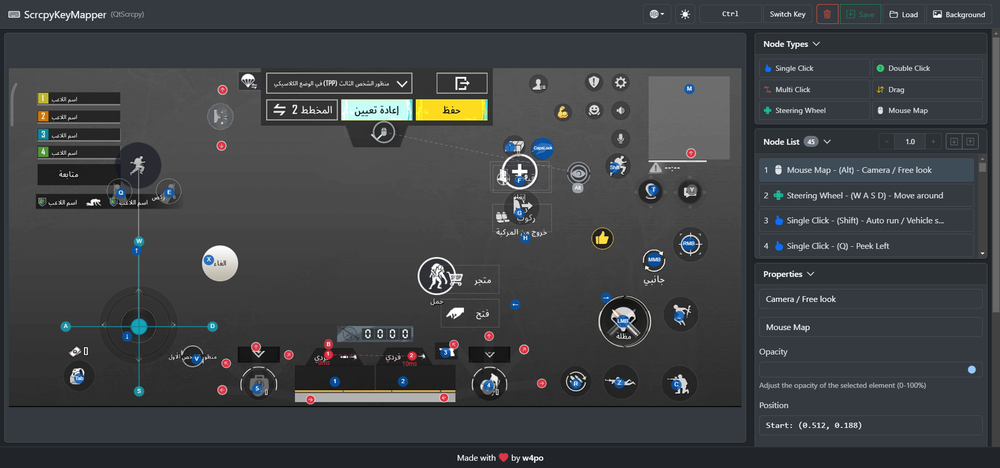

# ScrcpyKeyMapper (مخطط المفاتيح)

أداة رسومية لتخطيط المفاتيح لبرنامج [QtScrcpy](https://github.com/barry-ran/QtScrcpy)، تتيح لك إنشاء وإدارة ربط لوحة المفاتيح للتطبيقات والألعاب على الهاتف المحمول.

🌐 متوفر أيضاً باللغات: [English](README.md) | [中文](README_zh.md)

🔗 [جربه مباشرة!](https://w4po.github.io/ScrcpyKeyMapper)

## 🚀 المميزات

- واجهة مرئية لتخطيط المفاتيح
- دعم لجميع أنواع التخطيط:
  - نقرة واحدة
  - نقرة مزدوجة
  - نقرات متعددة
  - سحب
  - محاكاة الماوس
  - عجلة القيادة
- 🌓 دعم الوضع الفاتح/الداكن
- 🖼️ إمكانية رفع صورة خلفية للعمل عليها
- ✨ سهولة تحرير وإدارة العناصر
- 🖱️ واجهة السحب والإفلات
- 💾 استيراد/تصدير بتنسيق JSON
- 📐 تغيير الحجم تلقائياً حسب صورة الخلفية

## ⌨️ اختصارات لوحة المفاتيح

- **Ctrl** - اضغط باستمرار لنسخ عنصر
- **Shift** - اضغط باستمرار لتحريك العناصر المركبة
- **Ctrl + Shift** - اضغط كليهما معاً للنسخ والتحريك في نفس الوقت

## 🚦 البدء

1. قم برفع صورة خلفية للعمل عليها
2. أنشئ عناصر باختيار نوع العنصر المطلوب (نقر مزدوج أو سحب وإفلات)
3. ضع العناصر على الشاشة حيث تريد أن تحدث أحداث اللمس
4. قم بتكوين ربط المفاتيح والخصائص لكل عنصر
5. قم بتصدير إعدادات التخطيط لاستخدامها مع [QtScrcpy](https://github.com/barry-ran/QtScrcpy)

## 🛠️ مبني باستخدام

- [Konva.js](https://konvajs.org/) - إطار عمل JavaScript لـ HTML5 Canvas
- [Bootstrap 5](https://getbootstrap.com/) - إطار عمل CSS

## 💝 دعم المشروع

إذا وجدت هذه الأداة مفيدة وتريد دعمي، يمكنك:

- ⭐ إضافة نجمة للمشروع على GitHub
- 🐛 الإبلاغ عن الأخطاء أو اقتراح ميزات جديدة
- 🔀 المساهمة في تطوير المشروع
- 💰 تقديم تبرع:

دعمكم يساعد في تطوير وتحسين ScrcpyKeyMapper! ❤️

## 👨‍💻 المؤلف

- **w4po** - [GitHub](https://github.com/w4po)

