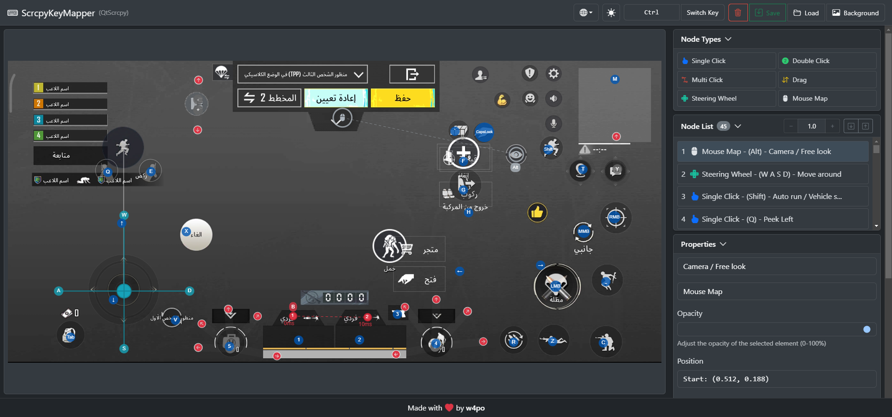

# ScrcpyKeyMapper (按键映射工具)

为 [QtScrcpy](https://github.com/barry-ran/QtScrcpy) 设计的图形化按键映射工具，让您能够轻松创建和管理手机应用与游戏的键盘映射。

🌐 其他语言版本: [English](README.md) | [العربية](README_ar.md)

🔗 [在线体验！](https://w4po.github.io/ScrcpyKeyMapper)

## 🚀 功能特点

- 可视化按键映射界面
- 支持所有映射类型：
  - 单击
  - 双击
  - 多点点击
  - 拖动
  - 鼠标模拟
  - 方向盘
- 🌓 明亮/暗黑主题支持
- 🖼️ 可上传背景图片进行操作
- ✨ 简单的元素编辑和管理
- 🖱️ 拖放式操作界面
- 💾 JSON格式导入/导出
- 📐 根据背景图片自动缩放

## ⌨️ 键盘快捷键

- **Ctrl** - 按住复制元素
- **Shift** - 按住移动复杂元素
- **Ctrl + Shift** - 同时按住实现复制并移动

## 🚦 使用入门

1. 上传背景图片开始工作
2. 选择所需元素类型创建元素（双击或拖放）
3. 将元素放置在需要触发触摸事件的屏幕位置
4. 为每个元素配置按键绑定和属性
5. 导出映射配置以供 [QtScrcpy](https://github.com/barry-ran/QtScrcpy) 使用

## 🛠️ 技术框架

- [Konva.js](https://konvajs.org/) - HTML5 Canvas JavaScript框架
- [Bootstrap 5](https://getbootstrap.com/) - CSS框架

## 💝 支持项目

如果您觉得这个工具有帮助并想支持我，您可以：

- ⭐ 在GitHub上为项目点亮星标
- 🐛 报告问题或提出新功能建议
- 🔀 参与项目开发
- 💰 捐赠支持:

您的支持将帮助 ScrcpyKeyMapper 变得更好！❤️

## 👨‍💻 作者

- **w4po** - [GitHub](https://github.com/w4po)
